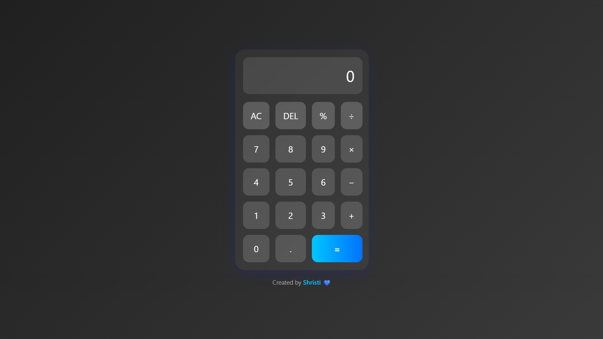

# 🧮 Modern Glassmorphism Calculator

A sleek and responsive calculator built with **HTML**, **CSS**, and **JavaScript** — featuring a stylish **glassmorphism UI**, keyboard support, and percentage calculation.

---

## ✨ Features

- 🔢 Basic arithmetic operations: `+`, `−`, `×`, `÷`, `%`
- 🎹 Keyboard input support (`Enter`, `Backspace`, `Esc`, numbers, operators)
- 💎 Elegant glassmorphism design
- 🧼 "AC" to clear, "DEL" to delete last digit
- 📱 Fully responsive on all devices

---

## 📸 Preview

 <!-- You can replace with your actual screenshot image path -->

---

## 🚀 Tech Stack

- **HTML5**
- **CSS3** (with backdrop filters for glass effect)
- **Vanilla JavaScript**

---

